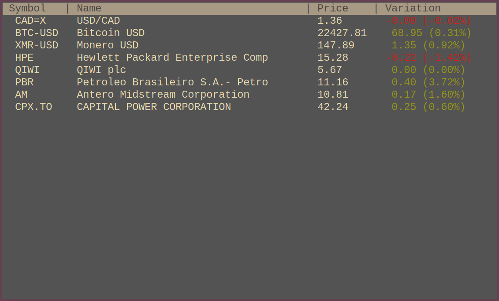

# TUIMarket

Fetch informations about stocks, currencies, cryptocurrencies in your terminal.
The program uses Yahoo Finance api.

## Configuration

The program will loads a list of symbols from one of those files :
* ~/.config/tuimarket/symbols
* ~/.tuimarket/symbols
* ~/.tuimarket_symbols

The file will be read one symbol per line.

## Keybindings

* k, up arrow	- scroll up
* j, down arrow	- scroll down
* q, escape	- exit

## Dependencies

* libcurl
* termbox2 (included in the source)
